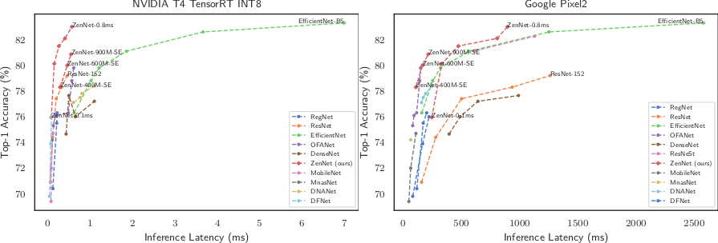

[](https://opensource.org/licenses/Apache-2.0)
[](https://arxiv.org/abs/2102.01063)

# ZenNAS: A Zero-Shot NAS for High-Performance Deep Image Recognition

ZenNAS is a lighting fast Neural Architecture Searching (NAS) algorithm for automatically designing deep neural networks with high prediction accuracy and high inference speed on GPU and mobile device.

Our paper is available here: [arXiv link](https://arxiv.org/abs/2102.01063)

## How Fast It IS

Using 1 GPU searching for 12 hours, ZenNAS is able to design networks of ImageNet top-1 accuracy comparable to EfficientNet-B5 (\~83%) while inference speed 11 times faster on NVIDIA T4, 2.6 times faster on Google Pixel2.



## Examples

To evaluate the pre-trained model on ImageNet using GPU 0:
```bash
python val.py --fp16 --gpu 0 --arch ${zennet_model_name}
```
where ${zennet_model_name} should be replaced by a valid ZenNet model name. The complete list of model names can be found in 'Pre-trained Models' section.

To evaluate the pre-trained model on CIFAR10 or CIFAR100 using GPU 0:
```bash
python val_cifar.py --dataset cifar10 --gpu 0 --arch ${zennet_model_name}
```

To create a ZenNet in your python code:
```python
gpu=0
model = ZenNet.get_ZenNet(opt.arch, pretrained=True)
torch.cuda.set_device(gpu)
torch.backends.cudnn.benchmark = True
model = model.cuda(gpu)
model = model.half()
model.eval()
```


## System Requirement and Default Paths
* PyTorch >= 1.5, Python >= 3.7
* By default, ImageNet dataset is stored under ~/data/imagenet; CIFAR10/CIFAR100 is stored under ~/data/pytorch_cifar10 or ~/data/pytorch_cifar100
* Pre-trained parameters are cached under ~/.cache/pytorch/checkpoints/zennet_pretrained

## Pre-trained Models

We provided pre-trained models on ImageNet and CIFAR10/CIFAR100.

### ImageNet Models

| model                                 | resolution | # params | FLOPs | Top-1 Acc | V100 | T4   | Pixel2  |
|---------------------------------------|------------|----------|-------|-----------|------|------|--------|
| [zennet_imagenet1k_flops400M_SE_res192](https://idstcv.oss-cn-zhangjiakou.aliyuncs.com/ZenNet/pretrained_models/zennet_imagenet1k_flops400M_SE_res192/student_best-params_rank0.pth) | 192        | 12.4M    | 453M  | 78.3%     | 0.29 | 0.29 | 109.7  |
| [zennet_imagenet1k_flops600M_SE_res256](https://idstcv.oss-cn-zhangjiakou.aliyuncs.com/ZenNet/pretrained_models/zennet_imagenet1k_flops600M_SE_res256/student_best-params_rank0.pth) | 256        | 12.6M    | 685M  | 80.0%     | 0.49 | 0.46 | 166.9  |
| [zennet_imagenet1k_flops900M_SE_res224](https://idstcv.oss-cn-zhangjiakou.aliyuncs.com/ZenNet/pretrained_models/zennet_imagenet1k_flops900M_SE_res224/student_best-params_rank0.pth) | 224        | 19.4M    | 934M  | 80.8%     | 0.55 | 0.55 | 215.7  |
| [zennet_imagenet1k_latency01ms_res192](https://idstcv.oss-cn-zhangjiakou.aliyuncs.com/ZenNet/pretrained_models/zennet_imagenet1k_latency01ms_res192/student_best-params_rank0.pth)  | 192        | 34.5M    | 1.8B  | 76.0%     | 0.1  | 0.08 | 246.9  |
| [zennet_imagenet1k_latency02ms_res192](https://idstcv.oss-cn-zhangjiakou.aliyuncs.com/ZenNet/pretrained_models/zennet_imagenet1k_latency02ms_res192/student_best-params_rank0.pth)  | 192        | 44.6M    | 3.0B  | 80.1%     | 0.2  | 0.16 | 332.5  |
| [zennet_imagenet1k_latency03ms_res224](https://idstcv.oss-cn-zhangjiakou.aliyuncs.com/ZenNet/pretrained_models/zennet_imagenet1k_latency03ms_res224/student_best-params_rank0.pth)  | 224        | 86.5M    | 5.1B  | 81.5%     | 0.3  | 0.26 | 475.6  |
| [zennet_imagenet1k_latency05ms_res224](https://idstcv.oss-cn-zhangjiakou.aliyuncs.com/ZenNet/pretrained_models/zennet_imagenet1k_latency05ms_res224/student_best-params_rank0.pth)  | 224        | 148.3M   | 8.2B  | 82.1%     | 0.5  | 0.41 | 808.3  |
| [zennet_imagenet1k_latency08ms_res224](https://idstcv.oss-cn-zhangjiakou.aliyuncs.com/ZenNet/pretrained_models/zennet_imagenet1k_latency08ms_res224/student_best-params_rank0.pth)  | 224        | 105.1M   | 9.4B  | 83.0%     | 0.8  | 0.57 | 896.0  |
| EfficientNet-B3                       | 300        | 12.0M    | 1.8B  | 81.1%     | 1.12 | 1.86 | 569.3  |
| EfficientNet-B5                       | 456        | 30.0M    | 9.9B  | 83.3%     | 4.5  | 7.0  | 2580.2 |

* 'V100' is the inference latency on NVIDIA V100 in milliseconds, benchmarked at batch size 64, float16.
* 'T4' is the inference latency on NVIDIA T4 in milliseconds, benchmarked at batch size 64, TensorRT INT8.
* 'Pixel2' is the inference latency on Google Pixel2 in milliseconds, benchmarked at single image.

### CIFAR10/CIFAR100 Models

| model                               | resolution | # params | FLOPs | Top-1 Acc |
|-------------------------------------|------------|----------|-------|-----------|
| [zennet_cifar10_model_size05M_res32](https://idstcv.oss-cn-zhangjiakou.aliyuncs.com/ZenNet/pretrained_models/zennet_cifar10_model_size05M_res32/best-params_rank0.pth)  | 32         | 0.5M     | 140M  | 96.2%     |
| [zennet_cifar10_model_size1M_res32](https://idstcv.oss-cn-zhangjiakou.aliyuncs.com/ZenNet/pretrained_models/zennet_cifar10_model_size1M_res32/best-params_rank0.pth)   | 32         | 1.0M     | 162M  | 96.2%     |
| [zennet_cifar10_model_size2M_res32](https://idstcv.oss-cn-zhangjiakou.aliyuncs.com/ZenNet/pretrained_models/zennet_cifar10_model_size2M_res32/best-params_rank0.pth)   | 32         | 2.0M     | 487M  | 97.5%     |
| [zennet_cifar100_model_size05M_res32](https://idstcv.oss-cn-zhangjiakou.aliyuncs.com/ZenNet/pretrained_models/zennet_cifar100_model_size05M_res32/best-params_rank0.pth) | 32         | 0.5M     | 140M  | 79.9%     |
| [zennet_cifar100_model_size1M_res32](https://idstcv.oss-cn-zhangjiakou.aliyuncs.com/ZenNet/pretrained_models/zennet_cifar100_model_size1M_res32/best-params_rank0.pth)  | 32         | 1.0M     | 162M  | 80.1%     |
| [zennet_cifar100_model_size2M_res32](https://idstcv.oss-cn-zhangjiakou.aliyuncs.com/ZenNet/pretrained_models/zennet_cifar100_model_size2M_res32/best-params_rank0.pth)  | 32         | 2.0M     | 487M  | 84.4%     |


## Major Contributor
* Ming Lin ([Home Page](https://minglin-home.github.io/), <linming04@gmail.com>)
* Pichao Wang (<pichao.wang@alibaba-inc.com>)
* Zhenhong Sun (<zhenhong.szh@alibaba-inc.com>)
* Hesen Chen (<hesen.chs@alibaba-inc.com>)

## Copyright
Copyright (C) 2010-2021 Alibaba Group Holding Limited.


