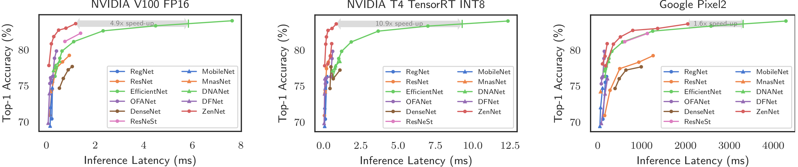

[](https://opensource.org/licenses/Apache-2.0)
[](https://arxiv.org/abs/2102.01063)


- [Zen-NAS: A Zero-Shot NAS for High-Performance Deep Image Recognition](#zen-nas-a-zero-shot-nas-for-high-performance-deep-image-recognition)
  - [How Fast](#how-fast)
  - [Compare to Other Zero-Shot NAS Proxies on CIFAR-10/100](#compare-to-other-zero-shot-nas-proxies-on-cifar-10100)
  - [Pre-trained Models](#pre-trained-models)
    - [ImageNet Models](#imagenet-models)
    - [CIFAR-10/CIFAR-100 Models](#cifar-10cifar-100-models)
  - [Reproduce Paper Experiments](#reproduce-paper-experiments)
    - [System Requirements](#system-requirements)
    - [Evaluate pre-trained models on ImageNet and CIFAR-10/100](#evaluate-pre-trained-models-on-imagenet-and-cifar-10100)
    - [Searching on CIFAR-10/100](#searching-on-cifar-10100)
    - [Searching on ImageNet](#searching-on-imagenet)
  - [Customize Your Own Search Space and Zero-Shot Proxy](#customize-your-own-search-space-and-zero-shot-proxy)
  - [FAQ](#faq)
  - [Major Contributors](#major-contributors)
  - [How to Cite This Work](#how-to-cite-this-work)
  - [Open Source](#open-source)
  - [Copyright](#copyright)


# Zen-NAS: A Zero-Shot NAS for High-Performance Deep Image Recognition

Zen-NAS is a lightning fast, training-free Neural Architecture Searching (NAS) algorithm for automatically designing deep neural networks with high prediction accuracy and high inference speed on GPU and mobile device. 

This repository contains pre-trained models, a mini framework for zero-shot NAS searching, and scripts to reproduce our results. You can even customize your own search space and develop a new zero-shot NAS proxy using our pipeline. Contributions are welcomed.

The arXiv version of our paper is available from [here](https://arxiv.org/abs/2102.01063). To appear in ICCV 2021. [bibtex](#how-to-cite-this-work)

## How Fast

Using 1 GPU searching for 12 hours, ZenNAS is able to design networks of ImageNet top-1 accuracy comparable to EfficientNet-B5 (\~83.6%) while inference speed 4.9x times faster on V100, 10x times faster on NVIDIA T4, 1.6x times faster on Google Pixel2.




## Compare to Other Zero-Shot NAS Proxies on CIFAR-10/100

We use the ResNet-like search space and search for models within parameter budget 1M. All models are searched by the same evolutionary strategy, trained on CIFAR-10/100 for 1440 epochs with auto-augmentation, cosine learning rate decay, weight decay 5e-4. We report the top-1 accuracies in the following table:


| proxy     | CIFAR-10 | CIFAR-100 |
|-----------|----------|-----------|
| Zen-NAS   | **96.2%**    | **80.1%**     |
| FLOPs     | 93.1%    | 64.7%     |
| grad-norm | 92.8%    | 65.4%     |
| [synflow](https://arxiv.org/abs/2101.08134)   | 95.1%    | 75.9%     |
| [TE-NAS](https://arxiv.org/abs/2102.11535)    | 96.1%    | 77.2%     |
| [NASWOT](https://arxiv.org/abs/2006.04647)    | 96.0%    | 77.5%     |
| Random    | 93.5%    | 71.1%     |

Please check our paper for more details.


## Pre-trained Models

We provided pre-trained models on ImageNet and CIFAR-10/CIFAR-100.

### ImageNet Models

| model | resolution | \# params | FLOPs | Top-1 Acc | V100 | T4 | Pixel2 |
| ----- | ---------- | -------- | ----- | --------- | ---- | --- | ------ |
| [zennet\_imagenet1k\_flops400M\_SE\_res224](https://idstcv.oss-cn-zhangjiakou.aliyuncs.com/ZenNet/pretrained_models/iccv2021_zennet_imagenet1k_flops400M_SE_res224/student_best-params_rank0.pth) | 224 | 5.7M | 410M | 78.0% | 0.25 | 0.39 | 87.9 |
| [zennet\_imagenet1k\_flops600M\_SE\_res224](https://idstcv.oss-cn-zhangjiakou.aliyuncs.com/ZenNet/pretrained_models/iccv2021_zennet_imagenet1k_flops600M_SE_res224/student_best-params_rank0.pth) | 224 | 7.1M | 611M | 79.1% | 0.36 | 0.52 | 128.6 |
| [zennet\_imagenet1k\_flops900M\_SE\_res224](https://idstcv.oss-cn-zhangjiakou.aliyuncs.com/ZenNet/pretrained_models/zennet_imagenet1k_flops900M_SE_res224/student_best-params_rank0.pth) | 224 | 19.4M | 934M | 80.8% | 0.55 | 0.55 | 215.7 |
| [zennet\_imagenet1k\_latency01ms\_res224](https://idstcv.oss-cn-zhangjiakou.aliyuncs.com/ZenNet/pretrained_models/iccv2021_zennet_imagenet1k_latency01ms_res224/student_best-params_rank0.pth) | 224 | 30.1M | 1.7B | 77.8% | 0.1 | 0.08 | 181.7 |
| [zennet\_imagenet1k\_latency02ms\_res224](https://idstcv.oss-cn-zhangjiakou.aliyuncs.com/ZenNet/pretrained_models/iccv2021_zennet_imagenet1k_latency02ms_res224/student_best-params_rank0.pth) | 224 | 49.7M | 3.4B | 80.8% | 0.2 | 0.15 | 357.4 |
| [zennet\_imagenet1k\_latency03ms\_res224](https://idstcv.oss-cn-zhangjiakou.aliyuncs.com/ZenNet/pretrained_models/iccv2021_zennet_imagenet1k_latency03ms_res224/student_best-params_rank0.pth) | 224 | 85.4M | 4.8B | 81.5% | 0.3 | 0.20 | 517.0 |
| [zennet\_imagenet1k\_latency05ms\_res224](https://idstcv.oss-cn-zhangjiakou.aliyuncs.com/ZenNet/pretrained_models/iccv2021_zennet_imagenet1k_latency05ms_res224/student_best-params_rank0.pth) | 224 | 118M | 8.3B | 82.7% | 0.5 | 0.30 | 798.7 |
| [zennet\_imagenet1k\_latency08ms\_res224](https://idstcv.oss-cn-zhangjiakou.aliyuncs.com/ZenNet/pretrained_models/iccv2021_zennet_imagenet1k_latency08ms_res224/student_best-params_rank0.pth) | 224 | 183M | 13.9B | 83.0% | 0.8 | 0.57 | 1365 |
| [zennet\_imagenet1k\_latency12ms\_res224](https://idstcv.oss-cn-zhangjiakou.aliyuncs.com/ZenNet/pretrained_models/iccv2021_zennet_imagenet1k_latency12ms_res224/student_best-params_rank0.pth) | 224 | 180M | 22.0B | 83.6% | 1.2 | 0.85 | 2051 |
| EfficientNet-B3 | 300 | 12.0M | 1.8B | 81.1% | 1.12 | 1.86 | 569.3 |
| EfficientNet-B5 | 456 | 30.0M | 9.9B | 83.3% | 4.5 | 7.0 | 2580 |
| EfficientNet-B6 | 528 | 43M | 19.0B | 84.0% | 7.64 | 12.3 | 4288 |

* 'V100' is the inference latency on NVIDIA V100 in milliseconds, benchmarked at batch size 64, float16.
* 'T4' is the inference latency on NVIDIA T4 in milliseconds, benchmarked at batch size 64, TensorRT INT8.
* 'Pixel2' is the inference latency on Google Pixel2 in milliseconds, benchmarked at single image.

### CIFAR-10/CIFAR-100 Models

| model | resolution | \# params | FLOPs | Top-1 Acc |
| ----- | ---------- | -------- | ----- | --------- |
| [zennet\_cifar10\_model\_size05M\_res32](https://idstcv.oss-cn-zhangjiakou.aliyuncs.com/ZenNet/pretrained_models/zennet_cifar10_model_size05M_res32/best-params_rank0.pth) | 32 | 0.5M | 140M | 96.2% |
| [zennet\_cifar10\_model\_size1M\_res32](https://idstcv.oss-cn-zhangjiakou.aliyuncs.com/ZenNet/pretrained_models/zennet_cifar10_model_size1M_res32/best-params_rank0.pth) | 32 | 1.0M | 162M | 96.2% |
| [zennet\_cifar10\_model\_size2M\_res32](https://idstcv.oss-cn-zhangjiakou.aliyuncs.com/ZenNet/pretrained_models/zennet_cifar10_model_size2M_res32/best-params_rank0.pth) | 32 | 2.0M | 487M | 97.5% |
| [zennet\_cifar100\_model\_size05M\_res32](https://idstcv.oss-cn-zhangjiakou.aliyuncs.com/ZenNet/pretrained_models/zennet_cifar100_model_size05M_res32/best-params_rank0.pth) | 32 | 0.5M | 140M | 79.9% |
| [zennet\_cifar100\_model\_size1M\_res32](https://idstcv.oss-cn-zhangjiakou.aliyuncs.com/ZenNet/pretrained_models/zennet_cifar100_model_size1M_res32/best-params_rank0.pth) | 32 | 1.0M | 162M | 80.1% |
| [zennet\_cifar100\_model\_size2M\_res32](https://idstcv.oss-cn-zhangjiakou.aliyuncs.com/ZenNet/pretrained_models/zennet_cifar100_model_size2M_res32/best-params_rank0.pth) | 32 | 2.0M | 487M | 84.4% |


## Reproduce Paper Experiments

### System Requirements

* PyTorch >= 1.5, Python >= 3.7
* By default, ImageNet dataset is stored under \~/data/imagenet; CIFAR-10/CIFAR-100 is stored under \~/data/pytorch\_cifar10 or \~/data/pytorch\_cifar100
* Pre-trained parameters are cached under \~/.cache/pytorch/checkpoints/zennet\_pretrained


### Evaluate pre-trained models on ImageNet and CIFAR-10/100

To evaluate the pre-trained model on ImageNet using GPU 0:

``` bash
python val.py --fp16 --gpu 0 --arch ${zennet_model_name}
```

where ${zennet\_model\_name} should be replaced by a valid ZenNet model name. The complete list of model names can be found in 'Pre-trained Models' section.

To evaluate the pre-trained model on CIFAR-10 or CIFAR-100 using GPU 0:

``` bash
python val_cifar.py --dataset cifar10 --gpu 0 --arch ${zennet_model_name}
```

To create a ZenNet in your python code:

``` python
gpu=0
model = ZenNet.get_ZenNet(opt.arch, pretrained=True)
torch.cuda.set_device(gpu)
torch.backends.cudnn.benchmark = True
model = model.cuda(gpu)
model = model.half()
model.eval()
```


### Searching on CIFAR-10/100
Searching for CIFAR-10/100 models with budget params < 1M , using different zero-shot proxies:

'''bash
scripts/Flops_NAS_cifar_params1M.sh
scripts/GradNorm_NAS_cifar_params1M.sh
scripts/NASWOT_NAS_cifar_params1M.sh
scripts/Params_NAS_cifar_params1M.sh
scripts/Random_NAS_cifar_params1M.sh
scripts/Syncflow_NAS_cifar_params1M.sh
scripts/TE_NAS_cifar_params1M.sh
scripts/Zen_NAS_cifar_params1M.sh
'''

### Searching on ImageNet

Searching for ImageNet models, with latency budget on NVIDIA V100 from 0.1 ms/image to 1.2 ms/image at batch size 64 FP16:

```bash
scripts/Zen_NAS_ImageNet_latency0.1ms.sh
scripts/Zen_NAS_ImageNet_latency0.2ms.sh
scripts/Zen_NAS_ImageNet_latency0.3ms.sh
scripts/Zen_NAS_ImageNet_latency0.5ms.sh
scripts/Zen_NAS_ImageNet_latency0.8ms.sh
scripts/Zen_NAS_ImageNet_latency1.2ms.sh
```

Searching for ImageNet models, with FLOPs budget from 400M to 800M:
``` bash
scripts/Zen_NAS_ImageNet_flops400M.sh
scripts/Zen_NAS_ImageNet_flops600M.sh
scripts/Zen_NAS_ImageNet_flops800M.sh
```


## Customize Your Own Search Space and Zero-Shot Proxy

The masternet definition is stored in "Masternet.py". The masternet takes in a structure string and parses it into a PyTorch nn.Module object. The structure string defines the layer structure which is implemented in "PlainNet/*.py" files. For example, in "PlainNet/SuperResK1KXK1.py", we defined SuperResK1K3K1 block, which consists of multiple layers of ResNet blocks. To define your own block, e.g. ABC_Block, first implement "PlainNet/ABC_Block.py". Then in "PlainNet/\_\_init\_\_.py",  after the last line, append the following lines to register the new block definition:

```python
from PlainNet import ABC_Block
_all_netblocks_dict_ = ABC_Block.register_netblocks_dict(_all_netblocks_dict_)
```

After the above registration call, the PlainNet module is able to parse your customized block from structure string.

The search space definitions are stored in SearchSpace/*.py. The important function is 

```python 
gen_search_space(block_list, block_id)
```

block_list is a list of super-blocks parsed by the masternet. block_id is the index of the block in block_list which will be replaced later by a mutated block This function must return a list of mutated blocks.

The zero-shot proxies are implemented in "ZeroShotProxy/*.py". The evolutionary algorithm is implemented in "evolution_search.py". "analyze_model.py" prints the FLOPs and model size of the given network. "benchmark_network_latency.py" measures the network inference latency. "train_image_classification.py" implements SGD gradient training and "ts_train_image_classification.py" implements teacher-student distillation.

## FAQ

Q: Why it is so slow when searching with latency constraints?
A: Most of the time is spent in benchmarking the network latency. We use a latency predictor in our paper, which is not released.

## Major Contributors

* Ming Lin ([Home Page](https://minglin-home.github.io/), [linming04@gmail.com](mailto:linming04@gmail.com), [ming.l@alibaba-inc.com](ming.l@alibaba-inc.com))
* Pichao Wang ([pichao.wang@alibaba-inc.com](mailto:pichao.wang@alibaba-inc.com))
* Zhenhong Sun ([zhenhong.szh@alibaba-inc.com](mailto:zhenhong.szh@alibaba-inc.com))
* Hesen Chen ([hesen.chs@alibaba-inc.com](mailto:hesen.chs@alibaba-inc.com))

## How to Cite This Work

Ming Lin, Pichao Wang, Zhenhong Sun, Hesen Chen, Xiuyu Sun, Qi Qian, Hao Li, Rong Jin. Zen-NAS: A Zero-Shot NAS for High-Performance Deep Image Recognition. 2021 IEEE/CVF International Conference on Computer Vision (ICCV 2021).


```bibtex
@inproceedings{ming_zennas_iccv2021,
  author    = {Ming Lin and Pichao Wang and Zhenhong Sun and Hesen Chen and Xiuyu Sun and Qi Qian and Hao Li and Rong Jin},
  title     = {Zen-NAS: A Zero-Shot NAS for High-Performance Deep Image Recognition},
  booktitle = {2021 IEEE/CVF International Conference on Computer Vision, {ICCV} 2021},  
  year      = {2021},
}
```

## Open Source

A few files in this repository are modified from the following open-source implementations:

```text
https://github.com/DeepVoltaire/AutoAugment/blob/master/autoaugment.py
https://github.com/VITA-Group/TENAS
https://github.com/SamsungLabs/zero-cost-nas
https://github.com/BayesWatch/nas-without-training
https://github.com/rwightman/gen-efficientnet-pytorch
https://pytorch.org/vision/0.8/_modules/torchvision/models/resnet.html
```

## Copyright

Copyright (C) 2010-2021 Alibaba Group Holding Limited.